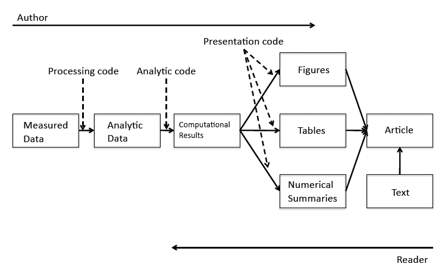

A primer on reproducible research: Basic principles and common tools
========================================================
author: Ben Marwick, University of Washington
date: December 2014
transition: none

Overview
======================================================== 

<ul>
<li> Definitions, motives, spectrum    
<li> Current practices     
<li> What I'm doing to improve reproducibility     
<li> What can be done to improve reproducibility?  
</ul>

Definitions are in flux
========================================================

Computational - Statistical - Emprirical

Stodden, V., et al. 2013. "Setting the default to reproducible." computational science research. SIAM News 46: 4-6.

Motivations: Claerbout's principle
========================================================

>"An article about a computational result is advertising, not scholarship. The actual scholarship is the full software environment, code and data, that produced the result." <small><small>- Claerbout and Karrenbach, Proceedings of the 62nd Annual International Meeting of the Society of Exploration Geophysics. 1992</small></small>

Claerbout's principle in detail
========================================================

>"When we publish articles containing figures which were generated by computer, we also publish the complete software environment which generates the figures" <small><small>- Buckheit & Donoho, Wavelab and Reproducible Research, 1995.</small></small>

>"The scholarship does not only consist of theorems and proofs but also (and perhaps even more important) of data, computer code and a runtime environment which provides readers with the possibility to reproduce all tables and figures in an article." <small><small>- Hothorn et al., 2009 Case studies in reproducibility</small></small>

Benefits are straightforward
=======================================================
- **Verification & Reliability**: Easier to find and fix bugs. The results you produce today will be the same results you will produce tomorrow.
- **Transparency**: Leads to broader impact, increased citation count, improved institutional memory
- **Efficiency**: Reuse allows for de-duplication of effort. Payoff in the (not so) long run
- **Flexibility**: When you don’t 'point-and-click' you gain many new analytic options.

But the limitations are substantial
=======================================================

**Technical**
- Classified/sensitive/big data 
- Software licensing issues
- Competition
- Neither necessary nor sufficient for correctness (but essential for dispute resolution)

***

**Cultural & personal**
- Reproducibility is not rewarded
- No-one expects or requires reproducibility 
- No uniform standards of reproducibility, so no established user base
- Embarassment

Our work exists on a spectrum of reproducibility
=======================================================

<small><small>Peng 2011, Science 334(6060) pp. 1226-1227</small></small>

Goal is to expose the reader to more of the research workflow
=======================================================

<small><small><small>http://www.stodden.net/AMP2011/slides/pengslides.pdf</small></small></small>

Current practices in many disciplines
========================================================
- Enter data in Excel
- Use Excel for data cleaning & descriptive statistics
- Import data into SPSS/SAS/Stata for further analysis
- Use point-and-click options to run statistical analyses
- Copy & paste output to Word document, repeatedly

***

========================================================
**Click-trails compromise clarity**

- Lots of human effort for tedious & time-wasting tasks
- Error-prone due to manual & ad hoc data handling (column and row offsets are common)
- Difficult to record -  hard to reconstruct a 'click history'
- Tiny changes in data or method require extensive reworking efforts

***

**Scripted analyses support scientific integrity**

- Plain text files will be readable for a long time
- Improved transparency, automation, maintanability, accessibility, portability, efficiency, communicability of process (what more could we want?)
- But there's a steep learning curve 

========================================================

What am I doing to encourage sharing?

========================================================
Using literate statistical programming

Using an open source programming language

Using an open document formatting language

Using version control 

Using dynamic documents

***
             
-------------- ----------- --------------
    

Using convenient tools, services & support
========================================================
`

`

***

========================================================

What can be done to improve code & data sharing?

========================================================

<small><small>Stodden (IASSIST 2010) sampled American academics registered at the Machine Learning conference NIPS (134 responses from 593 requests (23%). Red = communitarian norms, Blue = private incentives</small></small>

========================================================

<small><small>Stodden (IASSIST 2010) sampled American academics registered at the Machine Learning conference NIPS (134 responses from 593 requests (23%). Red = communitarian norms, Blue = private incentives</small></small>

Speed up culture change with incremental steps
========================================================
- **Promote culture change** through positive attribution 
- Implement mechanisms to indicate & encourage **degrees of compliance** (ie. clear definitions for different levels of reproducibility), cf. Stodden's:
 - 'Reproducible': compendium of text-code-data online
 - 'Reproduced': compendium available and independently reproduced 
 - 'Semi-Reproducible': when the full compendium is not released
 - 'Semi-Reproduced': independent reproduction with other data
 
 
Promote existing standards to normalise reproducible research
========================================================
- Schwab et al.: ER (Easily reproducible), CR (Conditionally reproducible), NR (Not reproducible)
- _Biostatistics_ opt-in **kite-marking of articles** (Peng 2009): D (data), C (code), R (both)
- **Reproducible Research Standard** (Stodden 2009): we should  
 - Release the full compendium on the internet
 - License media such as text, figures, tables with Creative Commons Attribution license (CC-BY) 
 - License code with one of Apache 2.0, MIT, LGPL, BSD, etc.
 - License "selection and arrangement" of data with CC0 or CC-BY

Use the Center for Open Science's badges
========================================================

An **incentive** to share data and code by acknowledging open practices with badges in publications. Currently used by _Psychological Science_

Integrate these values into everyday tasks
========================================================
- **Train students** by putting homework, assignments & dissertations on the reproducible research spectrum
- **Publish examples** of reproducible research in our field
- **Request** code & data when reviewing
- **Submit to & review for journals** that support reproducible research
- Critically review & audit **data management plans** in grant proposals
- Consider reproducibility wherever possible in **hiring, promotion & reference letters**.

Thanks.
========================================================
>"Abandoning the habit of secrecy in favor of process transparency and peer review was the crucial step by which alchemy became chemistry."
---
<small><small>-Raymond, E. S., 2004, The art of UNIX programming: Addison-Wesley.</small></small>

Colophon
========================================================
Presentation written in [Markdown](http://daringfireball.net/projects/markdown/) ([R Presentation](http://www.rstudio.com/ide/docs/presentations/overview))

Compiled into HTML5 using [RStudio](http://www.rstudio.com/ide/)

Source code hosting:

ORCID: http://orcid.org/0000-0001-7879-4531

Licensing: 

* Presentation: [CC-BY-3.0 ](http://creativecommons.org/licenses/by/3.0/us/)

* Source code: [MIT](http://opensource.org/licenses/MIT) 

